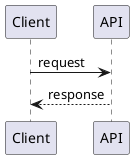

# PlantUML Node Skill

Use this skill when users want architecture docs with embedded PlantUML that render as static images in GitHub markdown.

## Supported diagram scope (MVP)

- Sequence diagrams only
- Supported lines:
  - `@startuml` / `@enduml`
  - `participant <name>`
  - `<A> -> <B>: <message>`
  - `<A> --> <B>: <message>`

## Primary workflow

1. Ensure architecture markdown includes fenced PlantUML blocks:



2. Build diagrams and inject image references:

```bash
npm run architecture:build -- <path-to-doc.md>
```

Optional output folder:

```bash
npm run architecture:build -- <path-to-doc.md> --diagrams-dir docs/diagrams
```

3. Commit updated markdown and generated artifacts:

- `docs/diagrams/<doc-slug>-diagram-<n>.puml`
- `docs/diagrams/<doc-slug>-diagram-<n>.svg`

## Editor workflow (optional)

Use the local web-component editor for visual authoring and export:

```bash
npm run editor
```

Open `http://localhost:4173` and use export buttons for SVG/PNG assets.

## Notes

- This skill uses a local JavaScript renderer for the MVP subset.
- For unsupported PlantUML syntax, simplify diagram content into the MVP subset.
